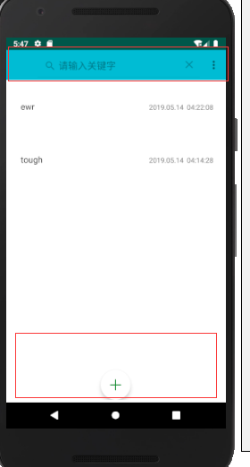
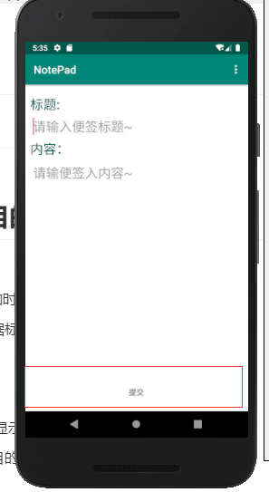

Read ME

## 一. 实验名称
NOTEPAD笔记本应用
## 二. 实验要求与目的
-基本要求  
1. NoteList中显示条目增加时间戳显示  
2. 添加笔记查询功能（根据标题查询）  

+附加功能  

1. UI美化
2. 更改记事本的背景,更改显示条目的颜色 
3. 笔记分类：根据显示条目的颜色进行分类
4. 分享功能

## 三. 实验步骤


实验截图：

搜索框 与 显示时间戳




添加页面 ，底下有提交按钮



### 
### 程序内容


实现显示时间

```
private void isSave(){
    SimpleDateFormat formatter = new SimpleDateFormat("yyyy.MM.dd  HH:mm:ss");
    Date curDate = new Date(System.currentTimeMillis());//获取当前时间
    String times = formatter.format(curDate);
    String title=ed1.getText().toString();
    String content=ed2.getText().toString();
    //是要修改数据
    if(ids!=0){
        cun=new Cuns(title,ids, content, times);
        cun.setColor(color);
        myDatabase.toUpdate(cun);
        Intent intent=new Intent(NewNote.this,MainActivity.class);
        startActivity(intent);
        NewNote.this.finish();
    }
    //新建日记
    else{
        cun=new Cuns(title,content,times);
        cun.setColor(color);
        myDatabase.toInsert(cun);
        Intent intent=new Intent(NewNote.this,MainActivity.class);
        startActivity(intent);
        NewNote.this.finish();
    }
}
```

   

2. 查询功能

   ```
   //实现搜素功能
       @Override
       public Filter getFilter() {
           // 如果MyFilter对象为空，那么重写创建一个
           if (filter == null) {
               filter = new MyFilter(list);
           }
           return filter;
       }
   
       class MyFilter extends Filter {
   
           private ArrayList<Cuns> original = new ArrayList<Cuns>();
   
           public MyFilter(ArrayList<Cuns> list) {
               this.original = list;
           }
           @Override
           protected FilterResults performFiltering(CharSequence constraint) {
               // 创建FilterResults对象
               FilterResults results = new FilterResults();
   
               if(TextUtils.isEmpty(constraint)){
                   results.values = original;
                   results.count = original.size();
               }else {
                  
                   ArrayList<Cuns> mList = new ArrayList<Cuns>();
            
                   for(Cuns s: original){                                        if(s.getTitle().trim().toLowerCase().contains(constraint.toString().trim().toLowerCase())){
                           mList.add(s);
                       }
                   }
                   results.values = mList;
                   results.count = mList.size();
               }
              
               return results;
           }
         
           @Override
           protected void publishResults(CharSequence constraint,
                                         FilterResults results) {
              
               list = (ArrayList<Cuns>) results.values;
           
               if(listener != null){
                   listener.getFilterData(list);
               }
      
               notifyDataSetChanged();
           }
       }
   
   ```

   


